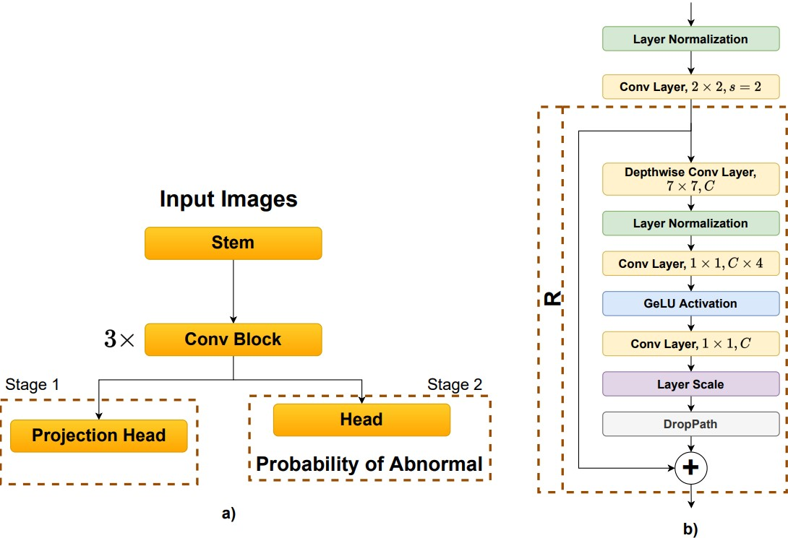

# Abnormalities classification for spinal lesions in radiographs collected by [vindr-spinexr](https://github.com/vinbigdata-medical/vindr-spinexr)

In this project, we employ a framework to classify spinal lesions from [VinDr-SpineXR dataset](https://physionet.org/content/vindr-spinexr/1.0.0/).

> **Note** that you will need to register an account to access the dataset.
>
> Please make sure you are following [Physionet agreement terms](https://physionet.org/content/vindr-spinexr/1.0.0/).
>
> The weights of our classification task can be found at this [drive](https://drive.google.com/drive/folders/14dB6Gn3c8u7QKrgwfh71qLwaTw0kptyv?usp=sharing).

## Installation
To install in Docker container

```bash
docker pull aominebka/spine_cls:v1
```
```bash
docker run -it aominebka/spine_cls:v1 
```
Then in the container, to download the code, run the command line:
```bash
source download_code.sh
```
## Overall framework
### Preprocessing
We convert dicom images to png images and resize them to the size of (224, 224). Images are preprocessed regarding the following script:
```bash
python preprocess_cls.py
```
### Train classification task

1. Train contrastive learning loss to learn a model to generate good latent space.

To train the classification task, in stage 1, you need to adjust the **classification_task/config.yaml** to :
```bash
SUP_LOSS: True
```
and run following command: 
```bash
python train_cls.py
```
2. Continue training the second stage to predict the abnormalities of images.
After get the best weight in stage 1, you can freeze or fine tune the weight to train the stage 2 by set the parameter **SUP_LOSS** to **False** run the file *train_clas.py* again.

### Evaluate Results
To assess the performance of the method, run the following command:
```bash
python evaluate_cls.py
```
Our result :
| F1_score    | auc_score | specificity | sensitivity |
| ----------- | ----------- | ----------- | ----------- |
| 0.806209    | 0.888451     | 0.827103 | 0.799404 |
